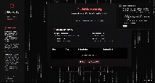

# Jabberwocky

> _A privacy-first browser utility that intercepts and obfuscates PII directly on your device._

---



---

## Table of Contents

- [Project Overview](#project-overview)
- [Screenshots](#screenshots)
- [Quick Start & Onboarding](#quick-start--onboarding)
- [Install and Integrate `snifferjs`](#install-and-integrate-snifferjs)
- [How to Make a Browser Extension](#how-to-make-a-browser-extension)
- [Troubleshooting & FAQ](#troubleshooting--faq)
- [Credits & License](#credits--license)
- [About Confident Security](#about-confident-security)

---

## Project Overview

Jabberwocky intercepts and scrambles your browser’s PII (personally identifiable information) — _before it ever leaves your machine_. There is **no cloud**, no tracking, and everything runs 100% locally.

---

## Screenshots

All these images are included in `/screenshots` for reliable rendering.

<table>
  <tr>
    <td>
      <b>Dashboard - Protection ON</b><br>
      
    </td>
    <td>
      <b>Dashboard - Protection OFF</b><br>
      
    </td>
  </tr>
  <tr>
    <td>
      <b>Extension Popup Modal</b><br>
      
    </td>
    <td>
      <b>Dashboard Top</b><br>
      
    </td>
  </tr>
  <tr>
    <td>
      <b>Dashboard Bottom</b><br>
      
    </td>
    <td>
      <b>Plugin Modal</b><br>
      
    </td>
  </tr>
</table>

---

## Quick Start & Onboarding

This section will get you running in just a few minutes! **You don’t need to be a developer: you can use GitHub, VSCode, or just a folder on your computer.**

### Option 1: Download or Clone

- **With GitHub:** Click the **Code** button on GitHub (top right), and “Download ZIP”. Unzip it.
- **With Git (in terminal):**
  ```sh
  git clone <your-repo-url>
  cd Jabberwocky
  ```
- **With GitHub Desktop:** Use the "Open with GitHub Desktop" button for a GUI experience.

### Option 2: Install Dependencies

- **Graphical Tools:** If you use [Visual Studio Code](https://code.visualstudio.com/), open the folder. VSCode will suggest to “Install dependencies”. Click the button!
- **Manual (terminal, optional):**
  ```sh
  npm install
  ```
  If you don't have Node.js, [download it here](https://nodejs.org/).

### Option 3: Run Locally

- **VSCode:** Look for a “Run and Debug” button (or `npm run dev` in the inbuilt terminal).
- **Manual (terminal, optional):**
  ```sh
  npm run dev
  ```
- Your browser should open at [http://localhost:5173](http://localhost:5173).

---

## Install and Integrate `snifferjs`

**Provide real PII interception with just a few easy steps!**

### 1. Install snifferjs

- **With VSCode GUI:** Open “Extensions”, search for “npm scripts”, and run “npm install snifferjs”.
- **Or in a terminal:**
  ```sh
  npm install snifferjs
  ```

### 2. Create the Integration File

- Open the `/src/lib/` folder (create if missing)
- **Make a new file** called `snifferjs.ts` and paste:
  ```ts
  // src/lib/snifferjs.ts
  import snifferjs from "snifferjs";
  snifferjs.patchAll();
  ```
- This makes sure snifferjs protects you immediately on site/app load.

### 3. Enable Sniffer in the App

- **Find your app’s main entry point** (`src/main.tsx`).
- **Add this line at the very top:**
  ```ts
  import "./lib/snifferjs";
  ```
- That's it! Jabberwocky will now intercept and scramble PII in real time.

---

## How to Make a Browser Extension

It's easy—just follow these steps! A ready-to-use manifest is provided below.

### 1. Create `manifest.json`

Copy this file into your project root:

```json
{
  "manifest_version": 3,
  "name": "Jabberwocky",
  "version": "1.0.0",
  "description": "A privacy tool to intercept and shield PII.",
  "permissions": ["activeTab", "storage", "scripting"],
  "action": {
    "default_popup": "index.html",
    "default_icon": {
      "16": "images/icon16.png",
      "48": "images/icon48.png",
      "128": "images/icon128.png"
    }
  },
  "content_scripts": [
    {
      "matches": ["<all_urls>"],
      "js": ["content.js"]
    }
  ],
  "background": {
    "service_worker": "background.js"
  },
  "icons": {
    "16": "images/icon16.png",
    "48": "images/icon48.png",
    "128": "images/icon128.png"
  }
}
```

#### What do these fields mean?
- `permissions`: Lets Jabberwocky access your tabs (to protect you).
- `action`: Makes your app show up as the extension popup.
- `content_scripts`: Tells the browser what to inject into each webpage.
- `background`: Runs the service worker code.
- `icons`: Sets the icons for your extension at various sizes.

### 2. Make Sure snifferjs Runs Immediately

- **Add this line at the very top of your extension’s main file** (`content.js` or similar):
  ```js
  import snifferjs from "snifferjs";
  snifferjs.patchAll();
  ```
  This makes privacy protection instant as soon as a page loads.

### 3. Use the Dashboard as Popup

- Build your app (`npm run build`)
- Set the extension’s popup to `index.html` or the correct build path.
- Load it in Chrome:
  - Go to `chrome://extensions`
  - Enable “Developer mode”
  - Click “Load unpacked” and select your `/dist` folder

---

## Troubleshooting & FAQ

**Images not showing up?**
- Double-check that you’re using the screenshots shipped in `/screenshots` and your README uses the correct file names/spelling/casing.

**Snifferjs not active?**
- Make sure you followed step 3 in “Install and Integrate snifferjs” above.
- Look at your browser console for warnings or errors.

**Not sure how to use the Terminal?**
- Try [GitHub Desktop](https://desktop.github.com/) or [Visual Studio Code](https://code.visualstudio.com/)—you can click buttons instead of typing commands!

**Still stuck?**
- Try restarting your computer, your browser, or deleting/reinstalling `node_modules`.

---

## Credits & License

- **Author:** Sam Krystal
- Built with [Lovable](https://lovable.dev) + [OpenAI](https://openai.com)
- PII interception via [snifferjs](https://github.com/cyphunk/snifferjs)
- Icons from [lucide.dev](https://lucide.dev/)
- Licensed under [MIT](LICENSE)

---

## About Confident Security

[Confident Security](https://confident.security/) helps organizations solve the hardest privacy and security challenges, from preventing breaches to building cutting-edge privacy products.  
**If you care about privacy for your company, clients, or product, [reach out to Sam Krystal](https://confident.security/)** and let's build the future of private tech together!

