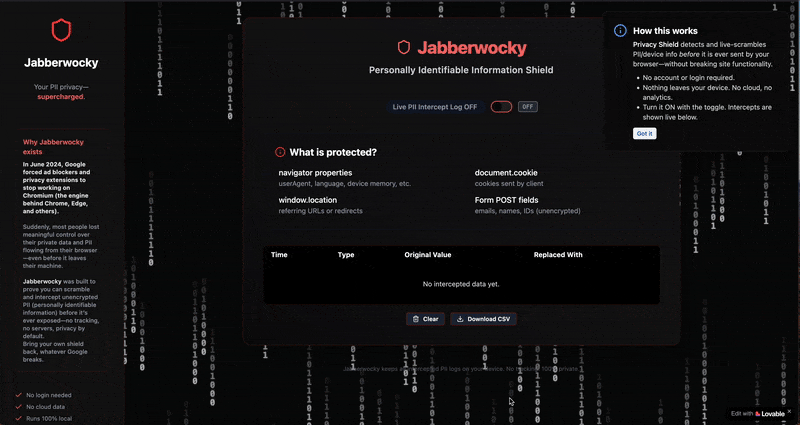

# Jabberwocky

> _A privacy-first browser utility that intercepts and obfuscates PII directly on your device._

**Author:** Sam Krystal

---

## Table of Contents

- [Project Overview](#project-overview)
- [Screenshots](#screenshots)
- [Demo GIF](#demo-gif)
- [Quick Start (Recommended)](#quick-start-recommended)
  - [Prerequisites](#prerequisites)
  - [Step 1: Clone the Repo](#step-1-clone-the-repo)
  - [Step 2: Install Dependencies](#step-2-install-dependencies)
  - [Step 3: Run Locally](#step-3-run-locally)
- [Functional Integration: Using snifferjs](#functional-integration-using-snifferjs)
  - [Install and Setup](#install-and-setup)
  - [Implement in Code](#implement-in-code)
  - [Connect Real Events to UI](#connect-real-events-to-ui)
- [Make a Browser Extension](#make-a-browser-extension)
- [Troubleshooting & FAQ](#troubleshooting--faq)
- [Credits & License](#credits--license)
---

## Project Overview

Jabberwocky intercepts and scrambles your browser’s PII (personally identifiable information) — _before it ever leaves your machine_. There is **no cloud**, no tracking, and everything runs 100% locally.

---

## Screenshots

All images are shipped with this repo in `/screenshots` for reliable rendering.

### Dashboard (Protection ON)


### Dashboard (Protection OFF)


### Extension Popup Preview


#### Additional Screenshots

- **Dashboard Top:**  
  
- **Dashboard Bottom:**  
  
- **Plugin Modal:**  
  

---

## Demo GIF

**See Jabberwocky in action (toggle, live log, export/clear):**



---

## Quick Start (Recommended)

This section will get you running in <3 minutes.

### Prerequisites

- Modern version of [Node.js](https://nodejs.org/) (20.x+ recommended)
- [Git](https://git-scm.com/downloads)

---

### Step 1: Clone the Repo

```sh
git clone <your-repo-url>
cd Jabberwocky
```

---

### Step 2: Install Dependencies

```sh
npm install
```

---

### Step 3: Run Locally

```sh
npm run dev
```

Then open your browser at [http://localhost:5173](http://localhost:5173).

---

## Functional Integration: Using snifferjs

_Hook up the real PII interception with just a few steps!_

### Install and Setup

1. **Install snifferjs**

   ```sh
   npm install snifferjs
   ```

2. **Create the Integration File**

   Create `src/lib/snifferjs.ts`:

   ```ts
   // src/lib/snifferjs.ts
   import snifferjs from "snifferjs";
   snifferjs.patchAll();
   // OPTIONAL: Export event bridge logic if needed.
   ```

3. **Replace the Mock Import**

   - Find all uses of `snifferjs-mock` in your source and **replace** with your new `snifferjs.ts`:
     > Example:
     > ```ts
     > import "./lib/snifferjs";
     > ```

---

### Implement in Code

- In your root entry (often `src/main.tsx` or `src/App.tsx`), import the integration at the very top (before any React code):

  ```ts
  import "./lib/snifferjs";
  ```

- This ensures interception is active **as soon as possible**.

---

### Connect Real Events to UI

- Wherever you build your log/state (for intercepted records), receive real snifferjs events and transform them to your UI’s format (`InterceptRecord`).
- See `snifferjs` [official docs](https://github.com/cyphunk/snifferjs) for more about subscribing to events.

---

## Make a Browser Extension

Turn this app into a Chrome/Edge extension!

### Step 1: Add `manifest.json`

Create a manifest in your project root. Example:

```json
{
  "manifest_version": 3,
  "name": "Jabberwocky",
  "version": "1.0.0",
  "permissions": ["scripting", "activeTab", "storage"],
  "background": {
    "service_worker": "background.js"
  }
  // ...add popup/option page etc as needed...
}
```
> _Docs:_ [MDN Chrome Extensions](https://developer.mozilla.org/en-US/docs/Mozilla/Add-ons/WebExtensions/manifest.json)

---

### Step 2: Inject snifferjs Early

- Ensure `snifferjs.patchAll()` runs as soon as possible (background or content script).

---

### Step 3: Use the Dashboard as Popup

- Set your **built React app** (`dist`) as the extension's `action.default_popup` in the manifest.
- Load `/dist` as an unpacked extension:  
  Go to `chrome://extensions` → Enable "Developer mode" → "Load unpacked".

---

## Troubleshooting & FAQ

**Images not showing?**  
- Double-check screenshot paths; these are relative to your `/screenshots` directory.

**Getting “snifferjs not patching”?**  
- Ensure `snifferjs` is imported/initialized *before* the app mounts.

**Other issues?**  
- Make sure all dependencies are installed  
- Try restarting your dev server  
- Watch your browser console for errors

---

## Credits & License

- **Author:** Sam Krystal
- Built using [Lovable](https://lovable.dev) + [OpenAI](https://openai.com)
- PII interception via [snifferjs](https://github.com/cyphunk/snifferjs)
- Icons by [lucide.dev](https://lucide.dev/)
- See [LICENSE](LICENSE) for full terms

---
